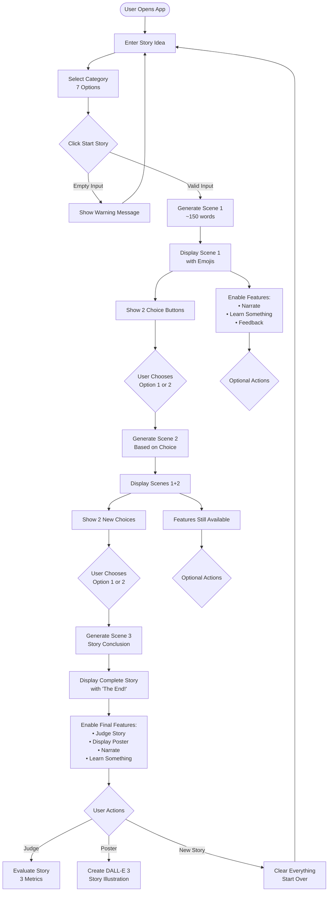
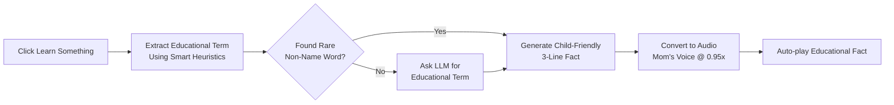
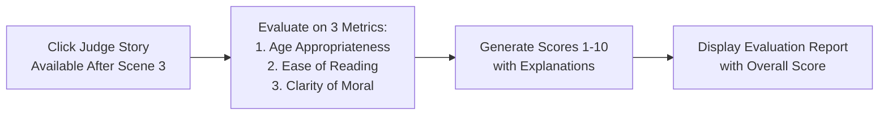
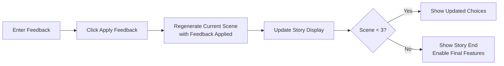
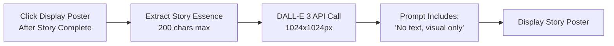

# Interactive Bedtime Stories - Flow Diagram

## System Overview
```
┌─────────────────────────────────────────────────────────────────────┐
│                    INTERACTIVE BEDTIME STORIES                      │
│                         Main Features:                              │
│  • 3-Scene Story Generation  • Voice Narration (4 voices)         │
│  • Story Evaluation (Judge)  • Educational Facts (Learn)           │
│  • Story Poster Generation   • Feedback & Revision                 │
└─────────────────────────────────────────────────────────────────────┘
```

## Main Flow Diagram



## Feature Flows

### 1. Narration Feature Flow
```mermaid
graph LR
    NarrateBtn[Click Listen to Scene] --> VoiceSelect[Select Voice:<br/>• Dad (fable)<br/>• Mom (shimmer)<br/>• Sister (nova)<br/>• Grandad (onyx)]
    VoiceSelect --> GenerateTTS[Generate Audio<br/>with Selected Voice]
    GenerateTTS --> PlayAudio[Auto-play Narration<br/>with Speed Adjustment]
    
    subgraph Speed Settings
        Dad[Dad: 0.9x]
        Mom[Mom: 0.9x]
        Sister[Sister: 1.1x]
        Grandad[Grandad: 0.8x]
    end
```

### 2. Learn Something Feature Flow


### 3. Story Judge Feature Flow


### 4. Feedback Feature Flow


### 5. Poster Generation Flow


## State Management
```
State Object = {
    scene_no: 1-3,              // Current scene number
    scenes: [scene1, scene2...], // Array of generated scenes
    idea: "user's input",        // Original story idea
    category: "selected category" // Story category
}
```

## Component Visibility Rules

| Component | Scene 1 | Scene 2 | Scene 3 | After Reset |
|-----------|---------|---------|---------|-------------|
| Choice Buttons | ✓ | ✓ | ✗ | ✗ |
| Feedback | ✓ | ✓ | ✓ | ✗ |
| Narrate | ✓ | ✓ | ✓ | ✗ |
| Learn | ✓ | ✓ | ✓ | ✗ |
| Judge | ✗ | ✗ | ✓ | ✗ |
| Poster | ✗ | ✗ | ✓ | ✗ |
| Voice Selector | ✓ | ✓ | ✓ | ✗ |

## Story Generation Parameters
- Model: GPT-4o-mini
- Temperature: 0.4
- Max tokens: 600 per scene
- Scene length: ~150 words each
- Total story: ~450-500 words

## Categories Available
1. Animal Adventures
2. Fantasy & Magic
3. Friendship & Emotional Growth
4. Mystery & Problem-Solving
5. Humor & Silly Situations
6. Science & Space Exploration
7. Values & Morals (Fables)

## Audio/Visual Features
- **TTS Voices**: 4 character options with different speeds
- **Image Generation**: DALL-E 3, no text in images
- **Audio Formats**: MP3 for narration and facts
- **Auto-play**: Enabled for both narration and educational facts